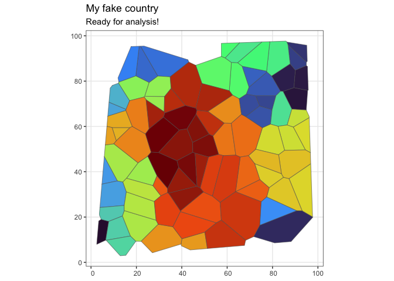

<!-- README.md is generated from README.Rmd. Please edit that file -->

# fakecountry

> A completely made up country consisting of smaller geographical areas
> to illustrate spatial statistical methods. Because… why not?

<!-- badges: start -->
<!-- badges: end -->

This is what I did:

1.  Create a set of random points that will serve as the centroids for
    the areas.
2.  Create a [Voronoi
    Diagram](https://en.wikipedia.org/wiki/Voronoi_diagram) to create
    polygons based on these points.
3.  Limit the Voronoi diagram to a bounding box to represent the
    country’s borders. I used an irregular pentagon for this purpose, to
    make it more natural looking.
4.  Look out for very small slivers of areas which are not very
    realistic. Any areas with measure less than a threshold are
    excluded.
5.  Save the polygons to a shapefile (in the data folder).

The actual script to generate the fake country is in Python. To load it
in R, do the following.

``` r
library(sf)
#> Linking to GEOS 3.11.0, GDAL 3.5.3, PROJ 9.1.0; sf_use_s2() is TRUE
fakecountry <- read_sf("data/fakecountry/", quiet = TRUE)
fakecountry
#> Simple feature collection with 82 features and 2 fields
#> Geometry type: POLYGON
#> Dimension:     XY
#> Bounding box:  xmin: 2.512683 ymin: 2.906362 xmax: 97.66561 ymax: 97.67862
#> CRS:           NA
#> # A tibble: 82 × 3
#>       id  area                                                          geometry
#>    <dbl> <dbl>                                                         <POLYGON>
#>  1     1  39.7 ((4.484017 18.98536, 7.82702 18.08883, 6.460537 9.788437, 2.5126…
#>  2     3  79.1 ((88.51209 67.63192, 84.61169 75.48464, 89.42076 77.1174, 95.491…
#>  3     4  55.0 ((95.49131 75.91668, 89.42076 77.1174, 90.03357 84.85946, 94.907…
#>  4     5  81.3 ((83.48903 75.53529, 79.56899 82.27061, 87.75736 87.63065, 90.03…
#>  5     7 216.  ((71.69574 11.36944, 74.36301 16.39134, 90.64767 22.83312, 93.01…
#>  6     9  37.6 ((94.92063 88.35084, 86.81073 95.96526, 86.33288 97.24828, 95.07…
#>  7    11  44.5 ((94.92063 88.35084, 94.90741 86.86726, 90.03357 84.85946, 87.75…
#>  8    12  39.3 ((79.81487 67.34576, 74.29233 68.99577, 72.48128 73.59632, 81.52…
#>  9    13  60.3 ((74.29233 68.99577, 68.12607 64.29624, 66.2672 65.28693, 65.272…
#> 10    14  69.1 ((79.1244 61.00315, 75.51044 59.34876, 68.12607 64.29624, 74.292…
#> # ℹ 72 more rows
```

## Plot

``` r
## library(tidyverse)
ggplot(fakecountry) +
  geom_sf(aes(fill = id)) +
  scale_fill_viridis_c(option = "turbo") +
  theme_bw() +
  theme(legend.position = "none") +
  labs(title = "My fake country",
       subtitle = "Ready for analysis!")
```

<!-- -->
